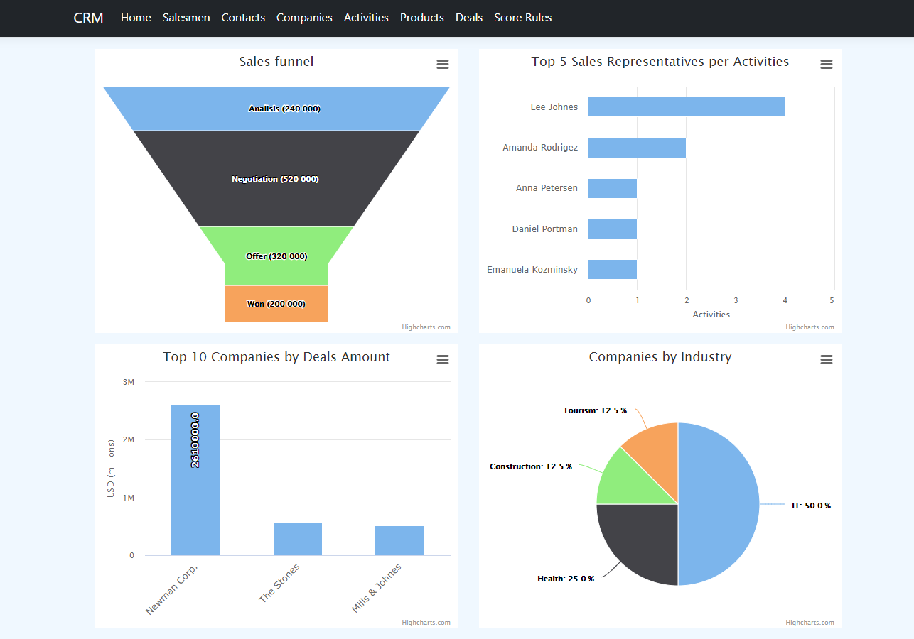
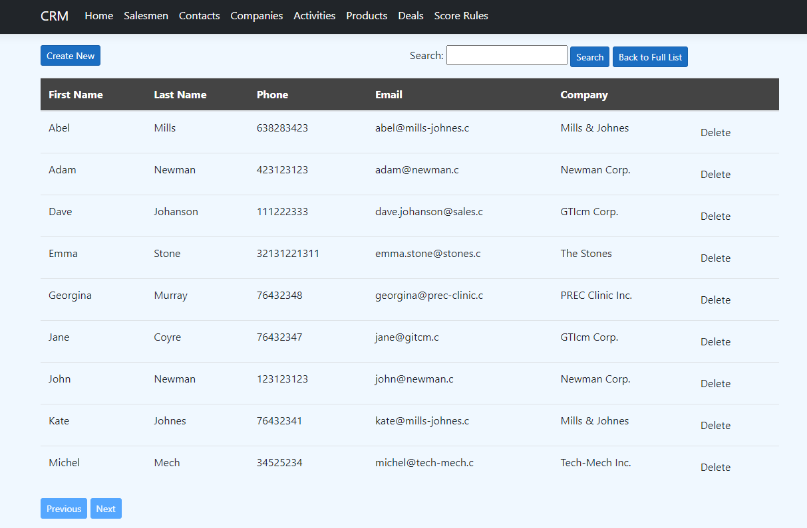
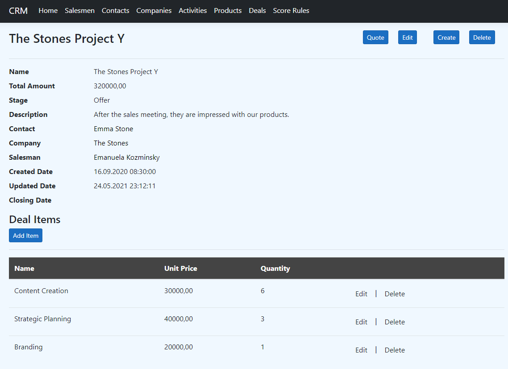
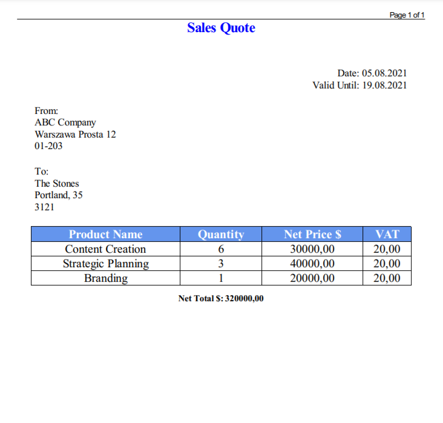

# CRM System

## General information
The system is designed to manage customer relationships. It enables to manage clients and track its interaction with organization. The CRM also allows to control the sales pipeline by defining sales deals/opportunities at the appropriate stage. Company scoring model enables initial classification of clients according to user defined rules. Application also supports sales quotation process. The system includes reporting and performance tracking module. The application interface provides data in different views and is built to allow navigation between related data.

## Technologies
* ASP.NET Core 3.1
* Entity Framework Core 3.1.12
* Microsoft SQL Server 2019
* HTML 5, CSS 3, Bootstrap
* Highcharts 8.2.2.2
* DinkToPdf 1.1.0

## Features
* Contacts management and assigning related activities.
* Companies management, assigning related contacts and sales deals.
* Companies scoring model.
* Defining products and services.
* Deals management - creating sales deals containing an order form with a list of the customer's products, unit price and quantity.
* Generating sales quote document based on deal items.
* Sales team management, assigning a salesperson to a given customer and a sales deals. The ability to track the work of the salesman by recording his meetings, phone calls and tasks.
* Tracking KPIs: sales funnel, sales team activities, segmentation of companies based on the industry, top 10 deals.
* Data in the form of list view and detailed view.
* Searching objects from list view.
* Navigation between related data.

## Application screenshots

### Home page

### Contact module - list view

### Deals module - details view

### Sales quote
